<p align="center">
  
</p>

# Strix Showcase
**Strix** is a powerful all-in-one **Unity Editor toolkit** developed by **Midori** with **Skyveil Studios**
> ⚠️ **In active development (WIP)** — Tool is still evolving and not yet finalized.

---

## Editor Tools
### 📊 Project Stats
Analyze project structure, file types, asset sizes, and more

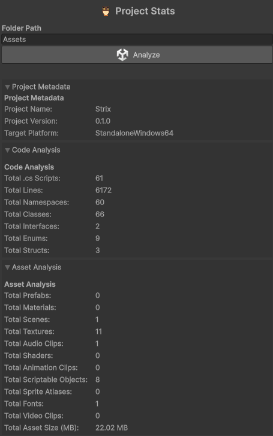

### ❓ Missing Script Finder
Scan for and locate GameObjects with missing script references

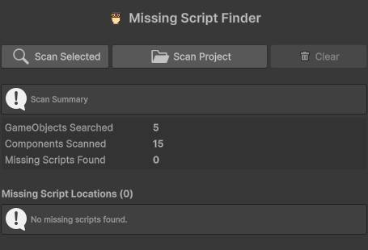

### 📋 Task Board
Simple task board for organizing your development workflow

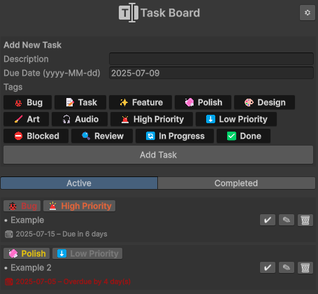

### 🗒️ Notepad
Notes panel for jotting down ideas, TODOs, or quick references

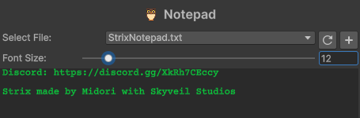

---

## 📂 Hierarchy
### 🔗 Hierarchy Lines
Draws connecting lines between objects to visualize parent to child relationships easier.
- Enable/Disable the option in Strix Hub
- Supports solid, dotted, and dashed styles
- Supports Dark/Light Mode

### Hierarchy Icons
Replaces default object icons with component icons.
- Top component takes priority
- Supports third part tools (ex: Mirror)

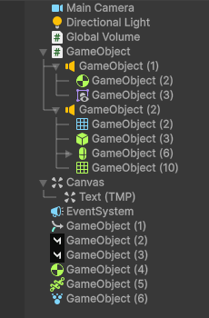
---

## Attributes
### 🖼️ ImagePreview
Show static images in the Inspector with optional sizing and alignment

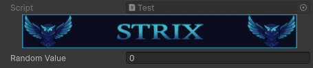
```c#
[ImagePreview("Assets/Strix/Banners/StrixBanner.jpg", 400f)]
[SerializeField] private float randomValue;
```

### 🛑 Required
Displays a warning when a field is missing or null

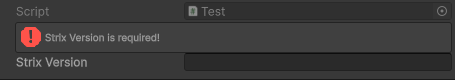
```c#
[Required]
[SerializeField] private string strixVersion;
```

### 🔒 ReadOnly
Displays fields grayed out and uneditable in the inspector

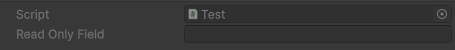
```c#
[ReadOnly]
[SerializeField] private string readOnlyField;
```

### 💬 HelpBox
Displays a help box above a field in the inspector

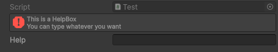
```c#
[HelpBox("This is a HelpBox\nYou can type whatever you want", MessageType.Error)]
[SerializeField] private string help;
```

### 🏷️ Title
Draws a colored title with a colored line above a field

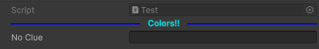
```c#
[Title("Colors!!")]
[SerializeField] private string noClue;
```


---

## Components

### 🔒 Transform Lock
Locks individual transform axes (position, rotation, scale) in the Editor

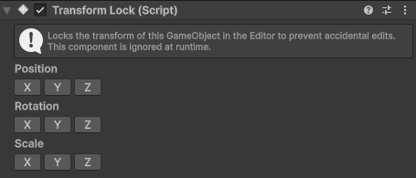

### 📝 Scene Note
Add color based notes and markers directly into your scene for communication or reminders

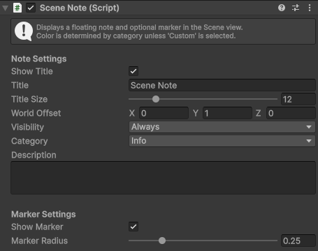

### 🎧 Audio Source Preview
Preview and control AudioSource playback in the editor without entering play mode

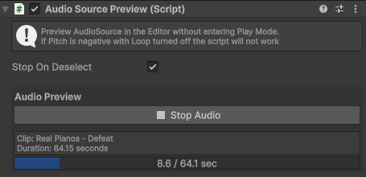

---
## 🔧 Utilities
### 🔍 Icon Browser
Browse and preview Unity’s internal editor icons for UI development

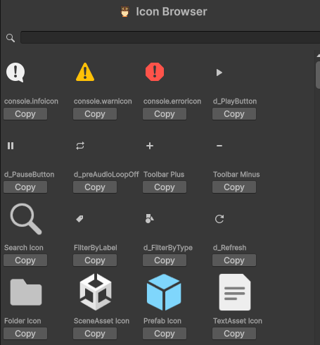

### 🐦 Strix Logger
Flexible logging utility with toggles, context highlights, color-coded messages, method tracing, and optional file output

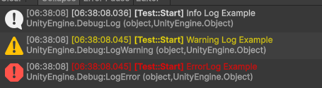

---

[Back to README](README.md)